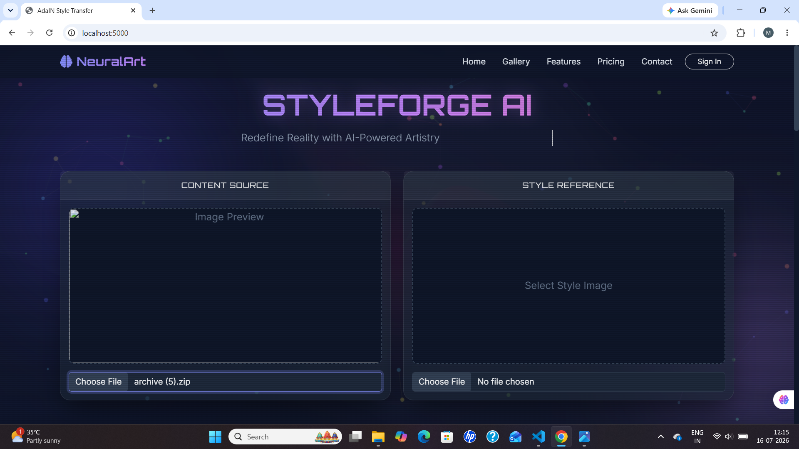
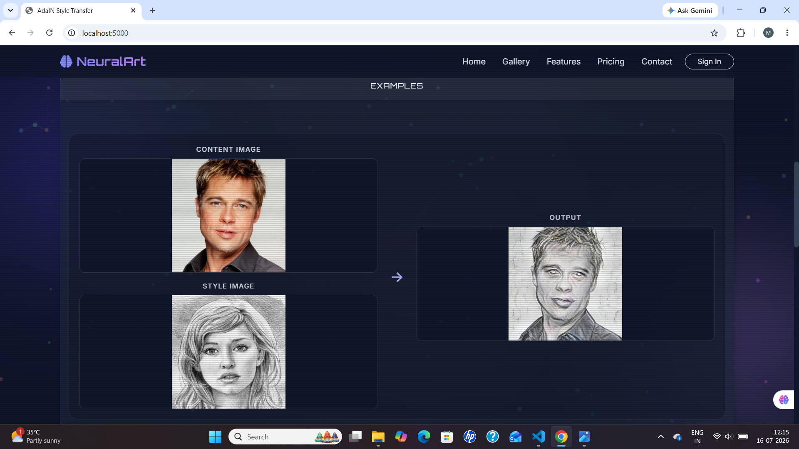

# 🎨 Neural Style Transfer using AdaIN

A deep learning project that implements **Arbitrary Neural Style Transfer** using **Adaptive Instance Normalization (AdaIN)**. The project includes:

- 🧠 AdaIN model training using **PyTorch**
- 🌐 A Flask web application for real-time style transfer

Users can upload a **content image** and a **style image**, adjust the style intensity using the **Alpha** parameter, and generate a stylized output.

---

# 📌 Project Overview

Neural Style Transfer combines the content of one image with the artistic style of another.

This project implements the **Adaptive Instance Normalization (AdaIN)** method proposed by **Huang & Belongie (ICCV 2017)**.

The model was trained using **PyTorch** on **Kaggle GPU**, and the trained decoder was integrated into a **Flask** web application for real-time image stylization.


# ✨ Features

- Adaptive Instance Normalization (AdaIN)
- Pretrained VGG-19 Encoder
- Custom-trained Decoder
- Arbitrary Style Transfer
- Flask-based Web Application
- Upload Content & Style Images
- Adjustable Style Strength (Alpha)
- Real-time Image Generation
- Resume Training from Checkpoints
- GPU / CPU Support

---

# 🛠️ Technologies Used

- Python
- PyTorch
- Torchvision
- Flask
- Flask-WTF
- Flask-Bootstrap
- HTML
- CSS
- JavaScript
- Bootstrap

---

# 🧠 Model Architecture

## Encoder

- Pretrained VGG-19
- Frozen during training
- Feature extraction up to **ReLU4_1**

---

## Decoder

The decoder reconstructs the stylized image from AdaIN features.

Components include:

- Reflection Padding
- Convolution Layers
- ReLU Activation
- Upsampling Layers

Only the **Decoder** is trained.

---

# 🔄 Training Pipeline

1. Load Content Image
2. Load Style Image
3. Extract Features using VGG Encoder
4. Apply Adaptive Instance Normalization (AdaIN)
5. Generate Stylized Image
6. Compute Content Loss
7. Compute Style Loss
8. Update Decoder Weights

---

# 📐 AdaIN Formula

\[
AdaIN(x,y)=\sigma(y)\left(\frac{x-\mu(x)}{\sigma(x)}\right)+\mu(y)
\]

Where

- **x** → Content Feature
- **y** → Style Feature

---

# 📊 Loss Function

## Content Loss

Mean Squared Error (MSE) between:

- Generated Features
- AdaIN Features

## Style Loss

Calculated using:

- Mean
- Standard Deviation

across multiple encoder layers.

### Total Loss

```
Loss = Content Loss + Style Weight × Style Loss
```

---

# 📈 Training Details

| Parameter | Value |
|-----------|--------|
| Framework | PyTorch |
| Image Size | 256 × 256 |
| Content Weight | 1 |
| Style Weight | 5 |
| Batch Size | 2 |
| Optimizer | Adam |
| Training Platform | Kaggle GPU |

Training was performed in multiple phases by resuming from saved checkpoints.

---

# 🌐 Web Application

The Flask application allows users to:

- Upload a Content Image
- Upload a Style Image
- Adjust Alpha (Style Strength)
- Generate Stylized Image
- View Results Instantly

---

# ⚙️ Installation

Clone the repository

```bash
git clone https://github.com/Minkal24/Neural-Style-Transfer.git
```

Move into the project

```bash
cd Neural-Style-Transfer
```

Create a virtual environment

```bash
python -m venv .venv
```

Activate it (Windows)

```bash
.venv\Scripts\activate
```

Install dependencies

```bash
pip install -r requirements.txt
```

---

# ▶️ Run the Flask Application

```bash
python app.py
```

Open

```
http://127.0.0.1:5000
```

---

# 🚀 Train the Model

```bash
python train.py
```

Resume training

```bash
python train.py --resume
```

---

# 📷 Screenshots

## 🏠 Home Page



---

## 🎨 Example



---

## 📤 Upload Image


---

# 🚀 Future Improvements

- Multiple Style Blending
- High Resolution Output
- Image Download Option
- Docker Deployment
- Cloud Model Hosting
- User Authentication

---

# 📚 Research Paper

**Arbitrary Style Transfer in Real-Time with Adaptive Instance Normalization**

**Authors:** Xun Huang, Serge Belongie

**Conference:** ICCV 2017

---

# 🙏 Acknowledgements

- PyTorch
- Torchvision
- Flask
- Kaggle
- ICCV 2017 AdaIN Paper
- VGG-19 Pretrained Model

---

# 👨‍💻 Author

## Minkal Katariya

Computer Science Student

**Interested in:**

- Deep Learning
- Computer Vision
- Generative AI
- PyTorch

---

## ⭐ If you found this project useful, please consider giving it a star!
